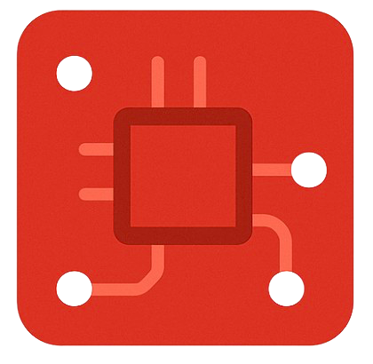

# Silicon



A Hack Club YSWS for devboards

## How to add your design to the gallery

> [!IMPORTANT]
> Only add your design here if it has been approved and you have placed your order

1. Fork this repository
2. Add a screenshot of a 3D view of your devboard to `public/devboards/`. Name it `[name-of-devboard].png` (make sure there aren't any spaces in the filename, formats other than PNG are fine)
3. Add your submission to `src/submissions.js`, format it as such:

    ```js
    {
      title: "Title of your devboard goes here",
      description: "Short description",
      creator: "Your slack username",
      image: "name-of-your-image.png",
      link: "https://github.com/Outdatedcandy92/PicoDucky",
      grant: grant_amount
    },
    ```

    The grant amount should be the coupon price (if you used oshwlabs) plus the amount paid by HCB. The link should be the URL of your oshwlabs project if you have one, else it should be the URL of your GitHub repository.
    Here's an example:

    ```js
    {
      title: "Pico Ducky Board",
      description: "Custom PiFido board for 2fa",
      creator: "Rudy",
      image: "picoducky.png",
      link: "https://github.com/Outdatedcandy92/PicoDucky",
      grant: 100
    },
    ```

4. Commit your changes
5. Submit a pull request titled:

    ```plaintext
    New submission: [project-name]
    ```

6. Once it's merged, your project should show up in the gallery!
